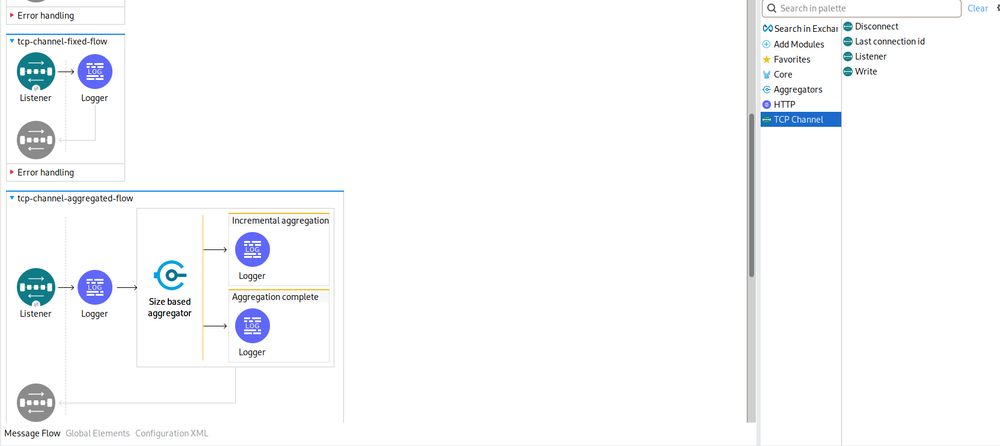

# TCP Channel Connector

A custom Mule 4 connector that exposes a TCP `<tcpc:listener>` source which
**keeps each accepted connection open across multiple framed messages**, plus
operations to **write to** and **disconnect** any live connection from another
flow.

It exists to fill a gap in the standard `org.mule.connectors:mule-sockets-connector`:
its built-in `SocketWorker` follows a strict *read → flow → write → close* cycle,
so a TCP peer can never send a second message on the same socket. This connector
runs an explicit accept loop and a per-connection read loop, which means a single
TCP session can carry an arbitrary stream of request/response or push messages.

> **Status: reference / sample.** This is a teaching example. It is not hardened
> for production: see [Caveats](#caveats--limitations) before using it in
> anything user-facing.

---

## Compatibility

| Item                 | Version                              |
|----------------------|--------------------------------------|
| Mule Runtime         | 4.6+ (tested on **4.11.3 EE**)       |
| Java                 | **17** (declared via `@JavaVersionSupport(JAVA_17)`) |
| `mule-modules-parent`| `1.9.11`                             |
| Packaging            | `mule-extension`                     |

The `@JavaVersionSupport` annotation is set to Java 17 only; if you need to run
on Java 8 or 11 you must change it explicitly and rebuild.

---

## Build

```bash
JAVA_HOME=/usr/lib/jvm/java-17-openjdk-amd64 mvn clean install
```

Installs `com.example:mule-tcp-channel-connector:1.0.0` (classifier
`mule-plugin`) into the local `~/.m2`. Add the dependency to a Mule application:

```xml
<dependency>
    <groupId>io.github.tmiya4ta</groupId>
    <artifactId>mule-tcp-channel-connector</artifactId>
    <version>1.0.0</version>
    <classifier>mule-plugin</classifier>
</dependency>
```

XML namespace:

```xml
xmlns:tcpc="http://www.mulesoft.org/schema/mule/tcpc"
xsi:schemaLocation="
    http://www.mulesoft.org/schema/mule/tcpc
    http://www.mulesoft.org/schema/mule/tcpc/current/mule-tcpc.xsd"
```

---

## DSL summary

### Configuration

```xml
<tcpc:listener-config name="my-config">
    <tcpc:connection host="0.0.0.0" port="5557" framing="LINE"/>
</tcpc:listener-config>
```

| Attribute        | Type    | Default     | Notes                                                             |
|------------------|---------|-------------|-------------------------------------------------------------------|
| `host`           | String  | `0.0.0.0`   | bind address                                                      |
| `port`           | int     | (required)  | TCP port                                                          |
| `framing`        | enum    | `LINE`      | `LINE`, `LENGTH_PREFIX`, or `FIXED_LENGTH` (see below)            |
| `lineDelimiter`  | enum    | `LF`        | terminator for `LINE`: `LF`, `CRLF`, or `NUL`. Ignored otherwise. |
| `maxFrameLength` | int     | `67108864`  | hard cap (bytes) per inbound frame; oversize frames close the conn|
| `keepAlive`      | boolean | `true`      | sets `SO_KEEPALIVE` on every accepted socket                      |
| `maxConnections` | int     | `200`       | concurrent connection cap; new accepts beyond it are closed       |
| `fixedFrameSize` | int     | `0`         | required (>0) when `framing=FIXED_LENGTH`; payload size in bytes   |
| `magicBytes`     | String  | `""`        | hex-encoded byte sequence prefixed to each FIXED_LENGTH frame; enables resync after garbage. e.g. `AABB`. |

### Source: `<tcpc:listener>`

Triggered for each framed message read from any accepted client. The flow's
final payload is sent back to the same socket as a response (the socket stays
open afterward).

```xml
<flow name="echo-flow">
    <tcpc:listener config-ref="my-config">
        <tcpc:response>#[payload]</tcpc:response>
    </tcpc:listener>
    <logger message="received #[sizeOf(payload)] bytes from #[attributes.connectionId]"/>
</flow>
```

The source's output type is `byte[]`; cast with `payload as String` if the
client speaks text.

`<tcpc:response>` is required only if you want a reply. Omit it for fire-and-forget.

#### Attributes (`attributes`)

| Field            | Type   | Meaning                                         |
|------------------|--------|-------------------------------------------------|
| `connectionId`   | String | UUID assigned to the live socket                |
| `remoteAddress`  | String | `Socket.getRemoteSocketAddress()` for the client|
| `messageIndex`   | long   | 1-based index of the message within this socket |

### Operations

```xml
<!-- Push an unsolicited message to a known live connection. -->
<tcpc:write config-ref="my-config" connectionId="#[vars.connId]">
    <tcpc:data>#[payload]</tcpc:data>
</tcpc:write>

<!-- Close a live connection from outside the listener flow. -->
<tcpc:disconnect config-ref="my-config" connectionId="#[vars.connId]"/>

<!-- Convenience for demos: returns the most recently accepted connectionId. -->
<tcpc:last-connection-id config-ref="my-config" target="connId"/>
```

The `<tcpc:data>` content accepts anything Mule can coerce to `InputStream`:
String, byte[], `java.io.InputStream`, DataWeave Binary, etc.

#### Errors

| Error                           | When                                 |
|---------------------------------|--------------------------------------|
| `TCPC:CONNECTION_NOT_FOUND`     | `connectionId` is not in the registry|
| `TCPC:IO`                       | underlying socket IO failed          |

---

## Framing

Both peers must agree on the same wire format. The server's framing is set on
`<tcpc:connection framing="..."/>` and is shared by the source and operations.

### `LINE`

Each message is terminated by the configured `lineDelimiter` (`LF`, `CRLF`,
or `NUL`). The payload delivered to the flow does NOT include the terminator.
For `LF` mode an optional preceding `\r` is stripped from the payload
(CRLF-tolerant). Outbound messages have the chosen terminator auto-appended
if missing. Suitable for telnet-style or newline-delimited text protocols.

### `LENGTH_PREFIX`

Each message is a 4-byte big-endian unsigned integer length followed by exactly
that many payload bytes. Length 0 is a valid empty message. Frame size is
capped by `maxFrameLength` (default 64 MiB). Self-synchronising: even a
malformed frame is followed by a fresh length read.
Suitable for arbitrary binary content (images, protobuf, custom packed structs).

### `FIXED_LENGTH`

Each message is exactly `fixedFrameSize` bytes long. Optionally preceded by
a `magicBytes` marker that the listener uses to **resynchronise after garbage
bytes on the stream**. Set `magicBytes=""` to disable the marker (in which
case any byte loss permanently corrupts framing — use only when both peers
are tightly co-designed).

The wire layout is `[magicBytes ...][payload of fixedFrameSize bytes]` per
message, repeated. On the read path, if `magicBytes` is non-empty the listener
discards bytes one by one until the magic prefix matches, then reads exactly
`fixedFrameSize` payload bytes and dispatches them. On the write path
(response and `<tcpc:write>`), the listener prepends `magicBytes` and
**enforces** that the outgoing payload is exactly `fixedFrameSize` bytes —
mismatches raise `TCPC:IO`.

Use this for fixed-record industrial / legacy protocols (sensor packets,
mainframe copybooks). Pick a `magicBytes` of at least 2 bytes that is
unlikely to occur inside payloads to maximise resync reliability.

Python encoder/decoder for `LENGTH_PREFIX`:

```python
import struct
def send_frame(sock, payload: bytes):
    sock.sendall(struct.pack(">I", len(payload)) + payload)
def recv_frame(sock) -> bytes:
    hdr = sock.recv(4, socket.MSG_WAITALL)
    (n,) = struct.unpack(">I", hdr)
    return sock.recv(n, socket.MSG_WAITALL)
```

Python encoder/decoder for `FIXED_LENGTH` with magic `0xAABB` and 16-byte payloads:

```python
MAGIC, SIZE = b"\xaa\xbb", 16
def send_frame(sock, payload: bytes):
    assert len(payload) == SIZE
    sock.sendall(MAGIC + payload)
def recv_frame(sock) -> bytes:
    return sock.recv(len(MAGIC) + SIZE, socket.MSG_WAITALL)[len(MAGIC):]
```

---

## Quick example

```xml
<tcpc:listener-config name="line">
    <tcpc:connection port="5557" framing="LINE"/>
</tcpc:listener-config>

<flow name="echo-line">
    <tcpc:listener config-ref="line">
        <tcpc:response>#[output text/plain --- "ACK: " ++ (payload as String)]</tcpc:response>
    </tcpc:listener>
</flow>
```

```bash
$ printf 'hello\n' | nc 127.0.0.1 5557
ACK: hello
```

For a multi-port (LINE + LENGTH_PREFIX + FIXED_LENGTH + aggregator) sample app
with HTTP-driven `push` and `disconnect` flows, see
[`example/sample-app`](example/sample-app/).



### Sample app build

Build the connector first so it lands in your local Maven repo, then build
the sample app:

```bash
# 1. Connector → ~/.m2/repository
JAVA_HOME=/usr/lib/jvm/java-17-openjdk-amd64 mvn clean install

# 2. Sample app
cd example/sample-app
JAVA_HOME=/usr/lib/jvm/java-17-openjdk-amd64 \
  mvn clean package -DskipTests -DattachMuleSources

# 3. Drop into a Mule standalone runtime
cp target/tcp-channel-sample-app-1.0.0-mule-application.jar $MULE_HOME/apps/
```

The sample exposes:

| Port  | Framing       | Flow                          |
|-------|---------------|-------------------------------|
| 5557  | LINE          | `tcp-channel-line-flow` — echoes `ACK#N: <line>` |
| 5558  | LENGTH_PREFIX | `tcp-channel-binary-flow` — binary echo |
| 5559  | FIXED_LENGTH  | `tcp-channel-fixed-flow` — 16-byte payloads, magic `0xAABB` |
| 5560  | LINE          | `tcp-channel-aggregated-flow` — size-based aggregator demo |
| 8282  | HTTP          | `/push`, `/close` against the latest LINE client |

See [`example/sample-app/README.md`](example/sample-app/README.md) for client
snippets and configuration overrides.

---

## Architecture

```
┌──────────────────┐  accept    ┌─────────────────────┐
│  ServerSocket    ├──────────► │  TcpChannelServer │
│  (one per cfg)   │            │  - connections Map  │
└──────────────────┘            │  - lastConnectionId │
                                └────────┬────────────┘
                                         │ shared via @Connection
                  ┌──────────────────────┼──────────────────────┐
                  ▼                      ▼                      ▼
            ┌──────────┐          ┌─────────────┐         ┌──────────────┐
            │ Source   │          │  write op   │         │ disconnect op│
            │ readLoop │          │  by connId  │         │  by connId   │
            └──────────┘          └─────────────┘         └──────────────┘
```

* `TcpChannelConnectionProvider` is a `CachedConnectionProvider`, so the
  source and every operation referencing the same `<tcpc:listener-config>`
  receive the **same** `TcpChannelServer` instance. The connection-id
  registry lives on that instance.
* The acceptor runs on a dedicated single-thread executor; each accepted
  socket gets its own thread from a cached pool that runs `readLoop`.
* `readLoop` calls `FrameCodec.readFrame(in, framing)` in a tight loop and
  hands each frame to `sourceCallback.handle(result, ctx)` with the
  `connectionId` stored in the callback context.
* The Source's `@OnSuccess` looks up the socket by `connectionId` and writes
  the response frame back. **The socket is not closed afterward** — the read
  loop simply waits for the next frame.

---

## Caveats & Limitations

Read these before doing anything beyond a demo.

### Functional

* **No backpressure.** Each accepted socket gets a thread, and each frame is
  handed off to the Mule flow with `sourceCallback.handle()`. If the flow
  cannot keep up, the socket's TCP receive buffer fills and the client stalls;
  there is no shed-load policy.
* **No TLS.** Plain TCP only; there is no `tlsContext` parameter. Add one
  by exposing a `javax.net.ssl.SSLContext` on the connection provider and
  swapping `ServerSocket` for `SSLServerSocket`.
* **No reconnection / retry parameters.** If `bind()` fails the deployment
  fails.
* **No application-level heartbeat.** `SO_KEEPALIVE` is enabled by default
  (see `keepAlive` parameter), which lets the OS detect half-dead peers
  — but only on the order of *hours* with stock Linux defaults. For
  sub-minute liveness checks, layer an app-level ping/pong on top.
* **`lastConnectionId` is single-client convenience only.** With multiple
  concurrent clients it returns whichever connected most recently and is
  a race. For multi-client routing, capture `attributes.connectionId` in the
  listener flow and persist it (ObjectStore, DB, broker) keyed by whatever
  identifies the client at the application layer.

### Lifecycle

* **OnStop closes everything.** Redeploy / undeploy invokes `onStop`, which
  closes every accepted socket (no graceful drain). In-flight flow executions
  for those sockets will see their response writes fail.
* **Flow errors keep the connection open.** `@OnError` only logs; it does not
  send anything to the client and does not close the socket. Add explicit
  error handling in the flow if you need to surface failures over the wire.

### API design

* **`@Content InputStream` is read fully into memory.** Both the source's
  response handler and the `write` operation call `readAllBytes()` on the
  incoming stream. Streaming a large payload directly to the socket without
  buffering would require extending `FrameCodec` (and is incompatible with
  `LENGTH_PREFIX`, which needs the length up front).
* **Single framing per config.** A given `<tcpc:listener-config>` runs one
  framing strategy for both directions and for all operations. To mix LINE
  and LENGTH_PREFIX in the same app, declare two configs on different ports.
* **LINE delimiter is one of `LF` / `CRLF` / `NUL`.** Custom byte sequences
  (e.g. `0x1E`-record-separator) require extending `LineDelimiter` and
  `FrameCodec`. Both peers must agree on the same delimiter.

### Testing / observability

* Logging is via SLF4J under `io.github.tmiya4ta.tcpchannel.*` at INFO. There are
  no metrics, no JMX beans, and no integration with `mule-jmx-module`. For
  CloudHub 2.0 use, you'd want to add at least connection-count gauges.
* MUnit tests are not included. The connector was validated end-to-end by
  external Python probes against a Mule EE 4.11.3 standalone runtime.

---

## File layout

```
mule-tcp-channel-connector/
├── pom.xml                                 # mule-extension, parent 1.9.11
├── README.md
├── example/
│   └── sample-app/                         # demo Mule app (LINE + LENGTH_PREFIX)
└── src/main/java/io/github/tmiya4ta/tcpchannel/
    ├── api/
    │   ├── Framing.java                    # LINE / LENGTH_PREFIX
    │   ├── LineDelimiter.java              # LF / CRLF / NUL
    │   └── TcpChannelAttributes.java
    └── internal/
        ├── TcpChannelExtension.java
        ├── config/TcpChannelConfiguration.java
        ├── connection/
        │   ├── TcpChannelServer.java                # registry + ServerSocket
        │   └── TcpChannelConnectionProvider.java
        ├── framing/FrameCodec.java                  # frame read/write
        ├── operations/
        │   ├── TcpChannelOperations.java            # write / disconnect / lastConnectionId
        │   └── TcpChannelErrors.java
        └── source/TcpChannelListener.java           # accept + read loops
```
